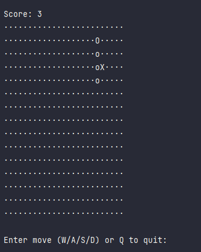
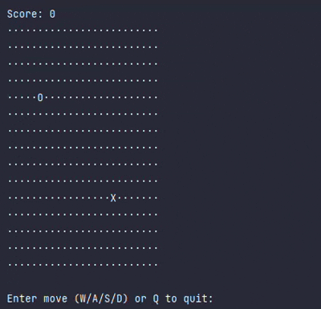

# Goal

In this tutorial, you'll build a **real-time console Snake game in Kotlin**. Unlike simple turn-based versions, the snake will move automatically and respond to your input instantly.

You'll learn how to:

* Create a **grid-based game**
* Move the snake **in real-time**
* Spawn **food** and grow the snake
* Detect **collisions**
* Clear the console properly
* Handle multiple game runs smoothly

**Reference / Full Code:**
The full working Kotlin file for this tutorial is included in this repository: [`SnakeGame.kt`](../src/main/kotlin/SnakeGame.kt)



---

## Previous Knowledge

You should already know:

* Kotlin basics (variables, functions, classes)
* Lists (`MutableList`)
* Loops (`while`, `for`)
* Conditionals (`if` / `when`)

No prior game dev experience is required.

---

## Concepts You'll Learn

Before we start coding, here are a few key concepts:

1. **Game Loop** – A loop that keeps the game running and updating every frame.
2. **Non-blocking Input** – Read user input without pausing the game.
3. **Grid Coordinates** – (x, y) positions on the board.
4. **Collision Detection** – Check if the snake hits a wall or itself.
5. **Console Refreshing** – Refresh the console for each frame.
6. **Thread-based Input** – Allows real-time response while the game updates.

---

# Tutorial

## 1. Create the SnakeGame class

We start by creating a Kotlin class to hold all our game logic.

```kotlin
class SnakeGame {
}
```

All game variables and functions will live inside this class. This class holds the game state, logic, and everything needed to run the game.

---

## 2. Define Game Variables

```kotlin
private val width = 25          // board width
private val height = 15         // board height

private var snake = mutableListOf(Pair(5, 5))  // initial snake position
private var direction = Pair(1, 0)            // moving right
private var food = spawnFood()                // spawn first food
private var score = 0
private var running = true

// Thread-safe variable to update snake direction from input thread
@Volatile private var nextDirection: Pair<Int, Int> = direction
```

`snake` is a list of (x, y) coordinates. `direction` controls movement each tick. `nextDirection` is used to safely update direction from another thread.

---

## 3. Start the Game Loop and Handle Input

```kotlin
fun start() {
    // Reset game state for multiple plays
    snake = mutableListOf(Pair(5, 5))
    direction = Pair(1, 0)
    nextDirection = direction
    food = spawnFood()
    score = 0
    running = true

    println("Controls: W A S D | Press Enter after each key")
    Thread.sleep(500)

    // Separate thread for handling input
    val inputThread = thread(start = true) {
        val reader = System.`in`
        while (running) {
            if (reader.available() > 0) { // check if a key was pressed
                when (reader.read().toChar().lowercaseChar()) {
                    'w' -> if (direction != Pair(0, 1)) nextDirection = Pair(0, -1) // prevent reversing
                    's' -> if (direction != Pair(0, -1)) nextDirection = Pair(0, 1)
                    'a' -> if (direction != Pair(1, 0)) nextDirection = Pair(-1, 0)
                    'd' -> if (direction != Pair(-1, 0)) nextDirection = Pair(1, 0)
                    'q' -> running = false
                }
            }
        }
    }

    while (running) {
        direction = nextDirection // apply latest direction
        if (!update()) break // move snake and check collisions

        clearConsole() // clear console for new frame
        draw()         // draw the board

        Thread.sleep(150) // game speed
    }

    running = false // stop input thread
    inputThread.join() // wait for input thread to finish
    println("\nGame Over! Score: $score")
}
```

> **Note:** In IntelliJ, key events may require pressing Enter. That's why each move uses Enter after typing W/A/S/D.

---

## 4. Update Snake Position and Handle Collisions

```kotlin
private fun update(): Boolean {
    val head = snake.first()
    val newHead = Pair(head.first + direction.first, head.second + direction.second)

    // collision check: walls or body
    if (newHead.first !in 0 until width || newHead.second !in 0 until height || snake.contains(newHead))
        return false

    snake.add(0, newHead) // move forward

    if (newHead == food) {
        score++
        food = spawnFood() // spawn new food if eaten
    } else {
        snake.removeLast() // remove tail if no food eaten
    }

    return true
}
```

---

## 5. Draw the Board

```kotlin
private fun draw() {
    println("Score: $score")
    for (y in 0 until height) {
        for (x in 0 until width) {
            when {
                Pair(x, y) == snake.first() -> print("O") // head
                snake.contains(Pair(x, y)) -> print("o")  // body
                Pair(x, y) == food -> print("X")          // food
                else -> print("·")                        // empty space
            }
        }
        println()
    }
}
```

---

## 6. Spawn Food

```kotlin
private fun spawnFood(): Pair<Int, Int> {
    var pos: Pair<Int, Int>
    do {
        pos = Pair(Random.nextInt(width), Random.nextInt(height))
    } while (snake.contains(pos)) // make sure food does not spawn on snake
    return pos
}
```

---

## 7. Clear the Console

```kotlin
private fun clearConsole() {
    repeat(height + 2) { println() } // push old output off screen
}
```

> **Note:** In IntelliJ, ANSI codes may not work properly, so we push the previous frame off screen.

---

## 8. Run the Game

```kotlin
fun main() {
    SnakeGame().start()
}
```

---

# Result

* Playable real-time Snake game
* Smooth graphics with minimal flicker
* Multiple runs without restarting program
* Score tracking



---

# Tips / What Could Go Wrong?

* IntelliJ may require pressing Enter after each key press.
* Avoid reversing direction instantly.
* Adjust `Thread.sleep(150)` to tweak game speed.

---

# Optional Enhancements

* Change snake/food symbols (`*`, `#`, etc.)
* Add walls or obstacles
* Increase speed over time
* Keep high score saved in a file
* Add color using ANSI escape codes

---

**Congratulations!** You now have made a simple Snake game in Kotlin.